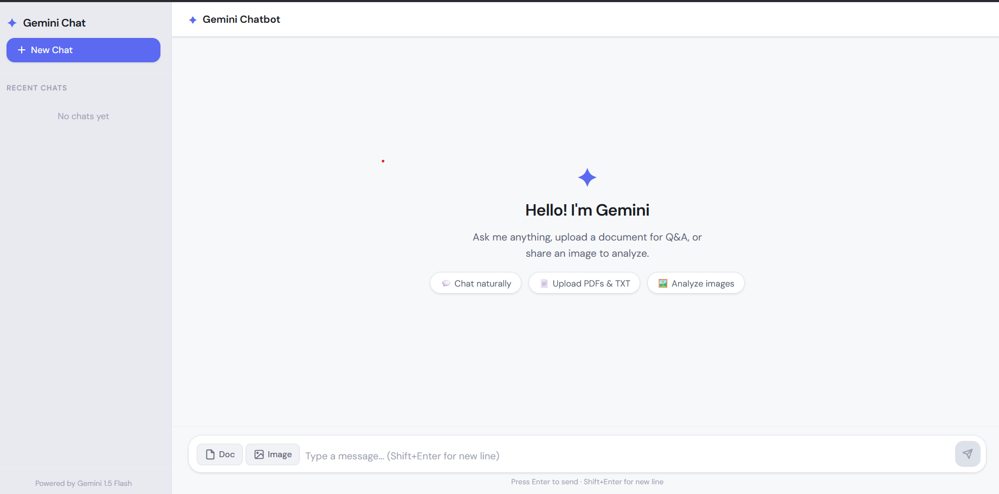

✦ Gemini Chatbot
A full-stack AI chatbot powered by Google's Gemini API. Supports text conversation, PDF/TXT document Q&A, and image analysis — all with multi-session chat management.

🔗 Live Demo

Frontend: https://gemini-chatbot-delta-seven.vercel.app
Backend: https://gemini-chatbot-1u3p.onrender.com


Note: Backend is hosted on Render free tier — first response after inactivity may take 30-40 seconds to wake up.# Gemini Chatbot

\---

 What's Inside

```
gemini-chatbot/
├── backend/       → Node.js + Express server
└── frontend/      → React app
```

\---

# Setup

 1\. Get a Gemini API Key

1. Go to [https://aistudio.google.com/app/apikey](https://aistudio.google.com/app/apikey)
2. Click **Create API Key**
3. Copy the key

\---

  2\. Set Up the Backend

```bash
cd backend
npm install
```

Create a `.env` file inside the `backend/` folder:

```
GEMINI\\\_API\\\_KEY=your\\\_api\\\_key\\\_here
PORT=5000
```

\---

3\. Set Up the Frontend

```bash
cd frontend
npm install
```

\---

## Running the App

You need **two terminals** open at the same time.

Terminal 1 — Start the backend:**

```bash
cd backend
npm start
```

Backend runs on `http://localhost:5000`

Terminal 2 — Start the frontend:**

```bash
cd frontend
npm start
```

Frontend opens at `http://localhost:3000`

\---

How to Use

Basic Chat

* Type your message in the input box and press **Enter** (or click Send)

Upload a Document

* Click the **Doc** button and select a `.pdf` or `.txt` file
* After upload, ask questions like:

  * *"Summarize this document"*
  * *"What is the main topic?"*

Upload an Image

* Click the **Image** button and select a `.png` or `.jpg` file
* After upload, ask questions like:

  * *"What's in this image?"*
  * *"Describe what you see"*

Start a New Chat

* Click **+ New Chat** in the sidebar to clear everything and start fresh
* Previous chat context and uploads are completely reset

\---

Preview



Notes

* Chat history is stored in memory only — it clears when the server restarts
* No database or login required
* Each chat session is independent

